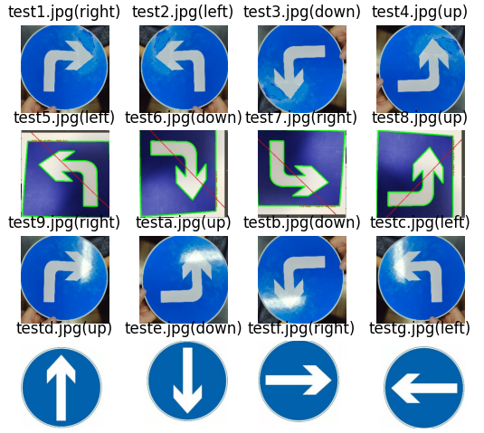

# 图像箭头方向识别

#### 介绍
简单的基于自己手动输入4个箭头方向的卷积核，计算的图像中箭头的方向

#### 软件架构
软件架构说明

#### 安装教程

1.  pip install numpy
2.  pip install matplotlib
3.  pip install opencv_python

#### 使用说明

1.  把箭头图像放进images文件夹下
2.  运行 python main.py
3.  效果图：

#### 参与贡献

1.  Fork 本仓库
2.  新建 Feat_xxx 分支
3.  提交代码
4.  新建 Pull Request
